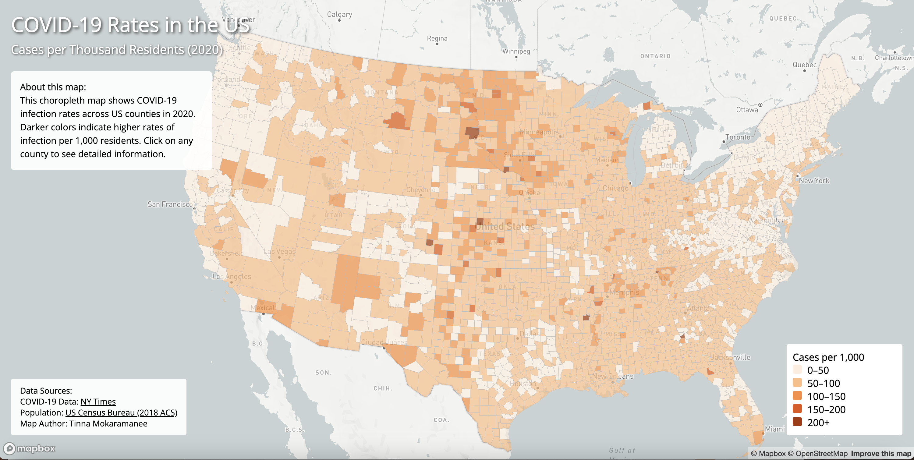
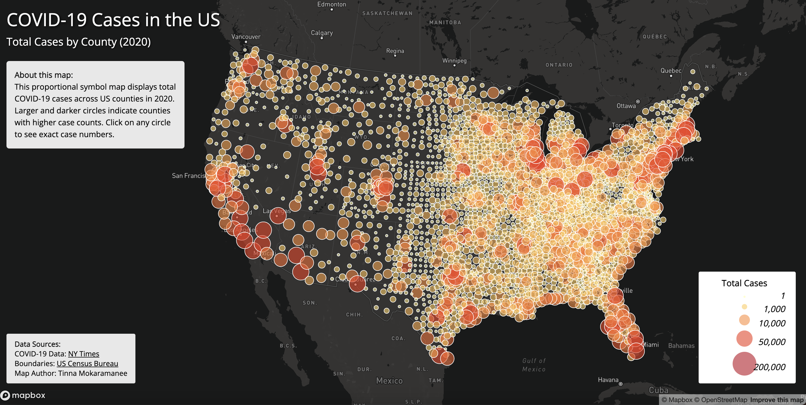

# COVID-19 Pandemic Impact in the United States (2020)

## Project Description

This project presents two interactive web maps visualizing the impact of COVID-19 across United States counties during 2020. The maps utilize Mapbox GL JS to create dynamic, interactive visualizations that allow users to explore COVID-19 case counts and infection rates at the county level.

### Map 1: Choropleth Map - COVID-19 Rates
This map displays the rate of COVID-19 cases per 1,000 residents across US counties. The choropleth visualization uses color gradients to represent infection rates, making it easy to identify areas with higher or lower rates of infection relative to their population size.

**[View Choropleth Map](https://tinnam11.github.io/us-covid-visualization/map1.html)**

### Map 2: Proportional Symbol Map - COVID-19 Cases
This map shows the total number of COVID-19 cases in each county using proportional symbols (circles). Larger and darker circles indicate counties with higher total case counts, providing a clear visual representation of the pandemic's geographic distribution.

**[View Proportional Symbol Map](https://tinnam11.github.io/us-covid-visualization/map2.html)**

## Screenshots

### Choropleth Map (Rates)

*Choropleth map showing COVID-19 infection rates per 1,000 residents*

### Proportional Symbols Map (Cases)

*Proportional symbol map displaying total COVID-19 cases by county*

## Features

### Interactive Elements
- **Click Interaction**: Click on any county (Map 1) or circle (Map 2) to view detailed information in a popup
- **Hover Effects**: Mouse cursor changes to pointer when hovering over interactive elements
- **Responsive Design**: Maps adapt to different screen sizes

### Map 1 (Choropleth) Specific Features
- Color coded counties based on infection rates
- Rate calculation: cases per 1,000 residents
- Range: 4.49 to 291.30 cases per 1,000

### Map 2 (Proportional Symbols) Specific Features
- Graduated circle sizes based on total case counts
- Four size categories with corresponding color gradients
- Circle opacity and stroke for better visibility
- Range: 1 to 756,412 total cases

## Primary Functions

### Data Processing
The project utilizes GeoJSON data that has been:
- Converted from shapefiles using Mapshaper
- Reprojected to WGS84 (EPSG:4326) for web mapping
- Simplified to reduce file size while maintaining accuracy
- Filtered to include only essential attributes

### Visualization Techniques
1. **Choropleth Mapping**: Uses Mapbox's `step` expression to assign colors based on data classification
2. **Proportional Symbols**: Implements Mapbox's `stops` property to scale circles based on case counts
3. **Interactive Popups**: Displays county name, state, case counts, and rates on click
4. **Dynamic Legends**: Programmatically generated using JavaScript

### Code Example - Proportional Symbols Implementation
```javascript
'circle-radius': {
    'property': 'cases',
    'stops': [
        [100, 4],
        [5000, 8],
        [25000, 14],
        [100000, 20]
    ]
}
```
This creates graduated circles where the radius increases proportionally with case counts.

## Libraries and Technologies

- **Mapbox GL JS**: Web mapping library for rendering interactive maps
  - Used for base map rendering, data visualization, and user interactions
  - Documentation: https://docs.mapbox.com/mapbox-gl-js/
  
- **Google Fonts**: Typography (Open Sans)
  - Provides consistent, professional font styling across browsers

## Data Sources

### COVID-19 Case Data
- **Source**: [The New York Times COVID-19 Database](https://github.com/nytimes/covid-19-data)
- **Time Period**: January - December 2020
- **Geographic Level**: County
- **License**: New York Times data is freely available for public use

### Population Data
- **Source**: [U.S. Census Bureau - American Community Survey (ACS)](https://www.census.gov/)
- **Year**: 2018 ACS 5-Year Estimates
- **Purpose**: Used to calculate infection rates (cases per 1,000 residents)

### Geographic Boundaries
- **Source**: [U.S. Census Bureau - Cartographic Boundary Files](https://www.census.gov/geographies/mapping-files/time-series/geo/carto-boundary-file.html)
- **Format**: Shapefiles converted to GeoJSON
- **Projection**: WGS84 (EPSG:4326)


- **Course**: GEOG 458 - Advanced Digital Geographies, University of Washington
- **Instructor**: Bo Zhao
- **Data Provider**: The New York Times for making COVID-19 data publicly available


---
